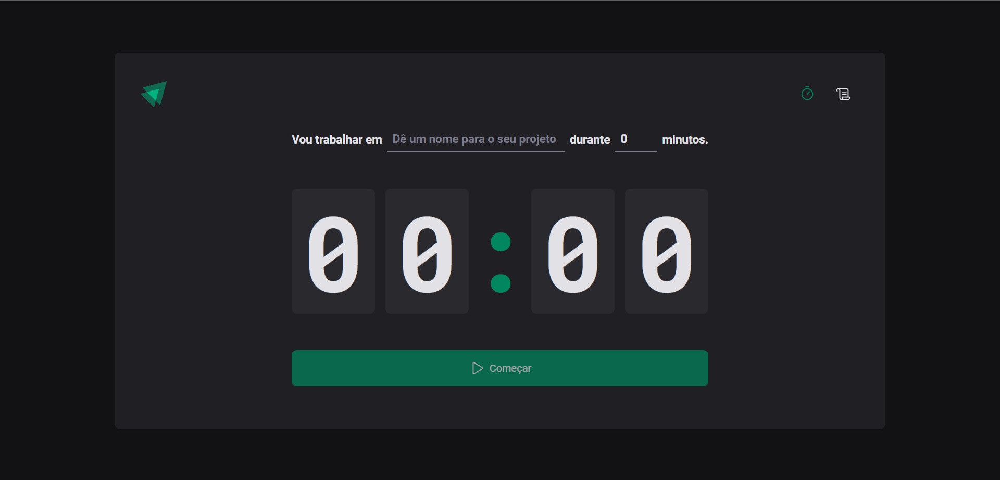

# Ignite Timer Rocketseat

Website criado como caso de estudos do Ignite da Rocketseat usando React, Typescript e Vite.

Você pode visitar o projeto em https://ignite-timer-two-lovat.vercel.app/

## O que foi aprendido

1. useContext
2. useReduce
3. immer
4. Styled Components

## Instalação

1. Clone o repositório: `git clone https://github.com/rodrigoqueiroz12/ignite-timer.git`
2. Navegue até o diretório do projeto: `cd .\ignite-timer\`
3. Instale as dependências: `npm i`, `pnpm i`.

## Propósito

Esse projeto foi criado com o intuito de praticar os conhecimentos adquiridos no Ignite da Rocketseat. O projeto se baseia apenas no front end, e salva os dados usando o localStorage.

## Contato

Se você quiser entrar em contato, você pode me encontrar em [rodrigo.queiroz0629@gmail.com].
